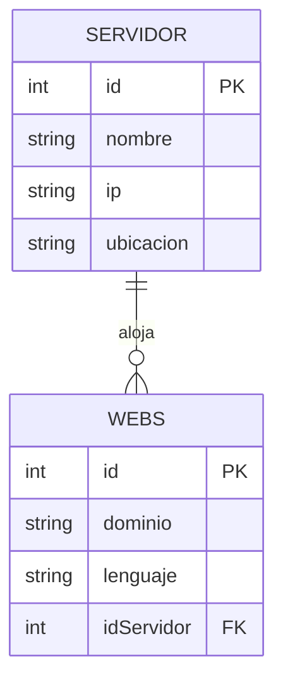

# Sistema de Gestión de Hosting - UT3

## Descripción del Proyecto

Sistema de gestión de Servidor y Webs que implementa el patrón DAO con tres tipos de conexión:
- **Mock**: Simulación en memoria sin base de datos
- **SQLite**: Base de datos local ligera
- **Oracle**: Base de datos empresarial

## Estructura del Proyecto

```
src/
├── model/
│   ├── Servidor.java     (Entidad Servidor)
│   └── Web.java      (Entidad Web con FK a Servidor)
├── dao/
│   ├── HostingDAO.java         (Interfaz DAO)
│   ├── MockHostingDAO.java     (Implementación Mock)
│   ├── SQLiteHostingDAO.java   (Implementación SQLite)
│   └── OracleHostingDAO.java   (Implementación Oracle)
└── main/
    └── Main.java                 (Menús y ejecución)
```

## Base de Datos

**Tabla 1: Servidor**
- id (PK) - Identificador único
- nombre - Nombre del servidor
- ip - Dirección IP del servidor
- ubicacion - Ubicación física del servidor

**Tabla 2: Webs**
- id (PK) - Identificador único
- dominio - Nombre de dominio
- lenguaje - Lenguaje/Tecnología utilizada
- idServidor (FK → Servidor.id) - Referencia al servidor que aloja la web

### Diagrama ER (Entity-Relationship)



## Datos de Ejemplo Automáticos

El sistema incluye datos personalizados para pruebas que se insertan automáticamente:

### Servidor Insertado
| Campo | Valor |
|-------|-------|
| **ID** | 1 |
| **Nombre** | IronMan-Server |
| **IP** | 192.168.1.19 |
| **Ubicación** | Madrid - PC Jarvis |

### Web Insertada
| Campo | Valor |
|-------|-------|
| **ID** | 1 |
| **Dominio** | balbe.xyz |
| **Lenguaje** | React / MariaDB |
| **Servidor asociado** | 1 (IronMan-Server) |

## Cómo Compilar y Ejecutar

### Compilar manualmente

```powershell
# Compilar
javac -d bin -sourcepath src src/main/Main.java

# Ejecutar
java -cp bin main.Main
```

## Funcionalidades

**Menú 1 - Tipo de Conexión:**
1. Mock
2. SQLite
3. Oracle

**Menú 2 - Operaciones:**
- a) Crear tablas
- b) Insertar Servidor (Tabla 1)
- c) Insertar Web (Tabla 2)
- d) Actualizar Servidor (Tabla 1)
- e) Actualizar Web (Tabla 2)
- f) Listar todos los Servidor
- g) Listar Servidor con sus Webs (relación FK)
- h) Buscar Servidor por ID (consulta con parámetro)
- 0) Salir

---
